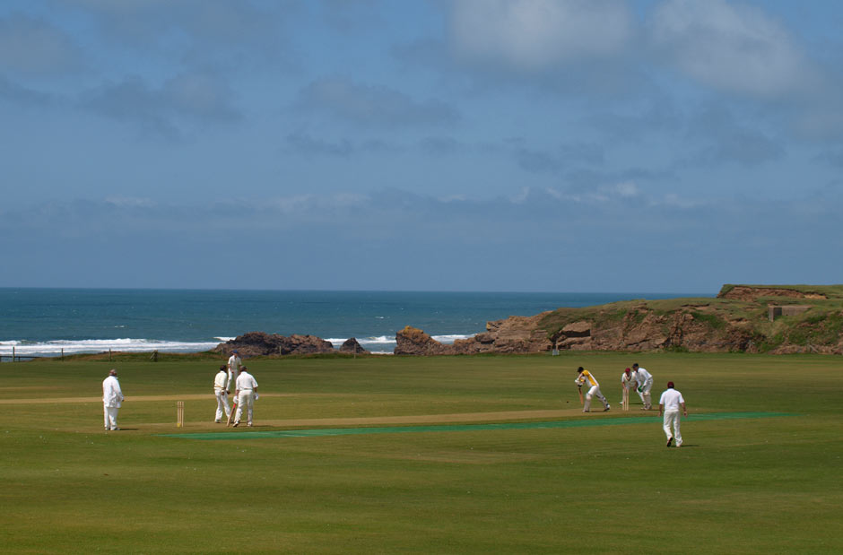

```{r setup, include=FALSE}
knitr::opts_chunk$set(echo = TRUE)
```
##Bude

Bude is a small seaside resort town in north Cornwall, England, UK, in the civil parish of Bude-Stratton and at the mouth of the River Neet (also known locally as the River Strat). It is sometimes formerly known as Bude Haven. It lies southwest of Stratton, south of Flexbury and Poughill, and north of Widemouth Bay and is located along the A3073 road off the A39. Bude is twinned with Ergué-Gabéric in Brittany, France.


```{r, include=FALSE}
library(tidyverse)
library(ggmap)
library(maps)
```

## The noticeable vacation spots 
There are some noticeable vacations spots in Bude. There is a cricket playground for players. There are two outstanding beaches are Summerleaze and Crooklets beaches. The visitors can go to the cricket club to play for fun, after they getting tired, they can go to pub Bar 35.


```{r ,message=FALSE, warning=FALSE, echo = FALSE}

Waterbude<- get_map(location = c(-4.5413, 50.82435), zoom = 14, maptype = "watercolor")
Roadmap <- get_map(location = c(-4.5413, 50.82435), zoom = 13, maptype = "roadmap")
ggmap(Roadmap)
ggmap(Waterbude)

gc1 <- geocode("Summerleaze beach, Bude EX23 8HN, UK")
gc2 <- geocode("S W Coast Path, Bude EX23 8NE, UK")
gc3 <- geocode("Bude North Cornwall Cricket Club,bude")
bar <- geocode("Bar 35,bude")
```

\newpage

## Bude road map
The blue points in the following graph are two beaches resorts, yellow point is playing cricket resort, red point is pub place. 


```{r message=FALSE, warning=FALSE echo=FALSE}
oadmap <- get_map(location = c(-4.5413, 50.82435), zoom = 14, maptype = "roadmap")
ggmap(roadmap)

ggmap(roadmap) +
  geom_point(
    aes(x = -4.5513493 , y = 50.8305399),
    color = "blue", size = 3) +
  geom_point(
    aes(x = -4.5543778 , y = 50.8368307),
    color = "blue", size = 3) +
  geom_point(
    aes(x = -4.5528138 , y = 50.8334672),
    color = "yellow", size = 3) +
  geom_point(
    aes(x = -4.5440883 , y = 50.8301612),
    color = "red", size = 3)

```

\newpage


## Road map from pub to cricket
The red line in the graph is the road from the Pub to the cricket club. This pub provides popular snacks  and recreation places. 




```{r message=FALSE, warning=FALSE echo=FALSE}
from <- "Bar 35,bude"
to <- "Bude North Cornwall Cricket Club,bude"
route_df <- route(from, to, structure = "route")
ggmap(roadmap) +  
  geom_path(
    aes(x = lon, y = lat), colour = "red", size = 1.5,
    data = route_df, lineend = "round"
  )
```

## watermap 


```{r message=FALSE, warning=FALSE echo=FALSE}
Waterbude<- get_map(location = c(-4.5413, 50.82435), zoom = 14, maptype = "watercolor")

ggmap(Waterbude) +
  geom_point(
    aes(x = -4.5513493 , y = 50.8305399),
    color = "blue", size = 3) +
  geom_point(
    aes(x = -4.5543778 , y = 50.8368307),
    color = "blue", size = 3) +
  geom_point(
    aes(x = -4.5528138 , y = 50.8334672),
    color = "yellow", size = 3) +
  geom_point(
    aes(x = -4.5440883 , y = 50.8301612),
    color = "red", size = 3)

```

## Watercolor road map from bar 35 to Bude North Cornwall Cricket Club


```{r message=FALSE, warning=FALSE echo=FALSE}

from <- "Bar 35,bude"
to <- "Bude North Cornwall Cricket Club,bude"
route_df <- route(from, to, structure = "route")
ggmap(Waterbude) +  
  geom_path(
    aes(x = lon, y = lat), colour = "red", size = 1.5,
    data = route_df, lineend = "round"
  )
    

```

